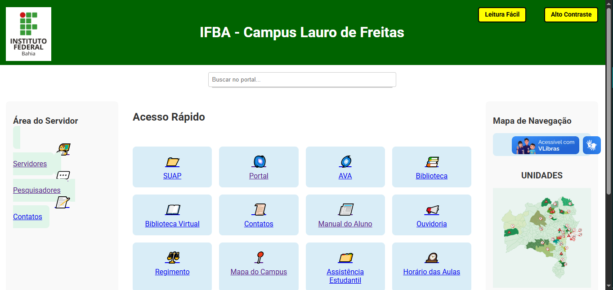

# Portal IFBA

Aplicação web desenvolvida com o objetivo de centralizar e facilitar o acesso às principais páginas e serviços do IFBA em um único lugar.

O projeto busca melhorar a navegação e reduzir o tempo gasto procurando links importantes no dia a dia acadêmico.

## Preview



## Demonstração

Acesse a versão online:
https://phel-lip.github.io/Projeto-Portal/

## Sobre o Projeto

Durante a rotina acadêmica, é comum a necessidade de acessar diversos sistemas e páginas institucionais.

Este projeto foi desenvolvido como um hub centralizado, reunindo os principais links do IFBA em uma interface simples, acessível e organizada.

## Funcionalidades

- Centralização de links importantes em um único local
- Interface limpa e de fácil navegação
- Estrutura organizada por categorias
- Acesso rápido a serviços utilizados com frequência

## Tecnologias Utilizadas

- HTML
- CSS
- JavaScript

## Estrutura do Projeto

- Organização semântica do HTML
- Estilização com foco em legibilidade e usabilidade
- Scripts para interações simples e navegação

## Como Executar Localmente

```bash
1. Clone o repositório: git clone https://github.com/Phel-lip/Projeto-Portal.git
2. Abra o arquivo `index.html` no navegador
```

## Objetivo

Este projeto foi desenvolvido com foco em usabilidade e organização de informação, visando resolver um problema real do cotidiano acadêmico.

## Autor

Thasso Felipe  
https://github.com/Phel-lip
