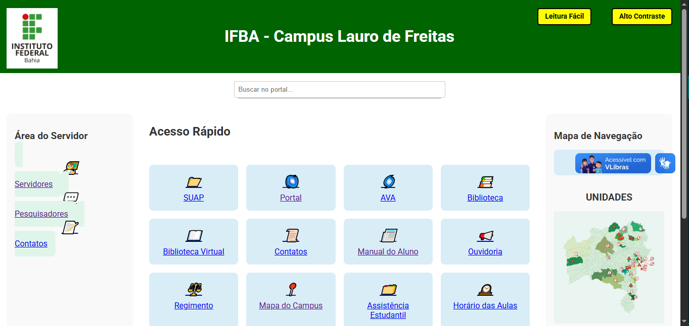

# Portal IFBA

Aplicação web desenvolvida para centralizar informações e facilitar o acesso a páginas e serviços em uma única interface.

O projeto utiliza o IFBA como estudo de caso, demonstrando uma solução que pode ser aplicada a qualquer organização que necessite reunir links e recursos em um único portal.

## Preview



## Demonstração

Acesse a versão online:

https://phel-lip.github.io/Projeto-Portal/

## Sobre o Projeto

Durante a rotina acadêmica, é comum acessar diversos sistemas e páginas institucionais.

Este projeto reúne esses recursos em uma interface simples, organizada, acessível e responsiva, tornando a navegação mais rápida e intuitiva.

## Recursos Implementados

* Centralização de links e recursos
* Busca por links com autocomplete
* Modal com mapa de navegação
* Layout responsivo
* Modo Alto Contraste
* Modo Leitura Fácil (OpenDyslexic)
* Integração com VLibras

## Tecnologias Utilizadas

* HTML
* CSS
* JavaScript

## Estrutura do Projeto

* HTML semântico
* CSS organizado por arquitetura (Design System, Layout, Componentes, Acessibilidade e Responsividade)
* JavaScript para busca, autocomplete, modal e recursos de acessibilidade

## Como Executar Localmente

```bash
git clone https://github.com/Phel-lip/Projeto-Portal.git
```

Após clonar o repositório, abra o arquivo `index.html` em qualquer navegador.

## Objetivo

Desenvolver uma aplicação web focada na organização de informações e experiência do usuário, aplicando conceitos de HTML, CSS e JavaScript, além de boas práticas de acessibilidade e responsividade.

## Autor

**Thasso Holanda**

https://github.com/Phel-lip
